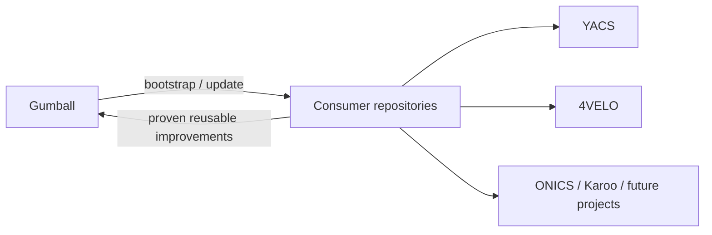

# Gumball

**Gumball** is the shared, versioned engineering platform for repositories owned by `karnalooch`.

It is not a static project template. Gumball is a living control plane for CI, security, governance, documentation, agent workflows and tooling. Consumer repositories both **adopt** platform contracts and **feed proven reusable improvements back upstream**.

> Compatibility: the repository is currently hosted at `karnalooch/engineering-platform`. Existing reusable-workflow consumers must keep that coordinate until a dedicated repository-rename migration updates and proves their immutable pins.

## The loop



Application code and product-specific runtime proof stay in product repositories. Gumball contains reusable engineering contracts and tools.

## Start here

- [Documentation map](docs/README.md)
- [Architecture](docs/ARCHITECTURE.md)
- [Adoption contract](docs/ADOPTION.md)
- [CI model](docs/CI_MODEL.md)
- [Downstream -> upstream promotion](docs/UPSTREAM_PROMOTION.md)
- [One-prompt bootstrap](docs/ONE_PROMPT_BOOTSTRAP.md)
- [MCP and tool capability contract](docs/MCP_AND_TOOLS.md)

## CLI

The initial standard-library-only helper supports conservative repository adoption:

```bash
python scripts/gumball.py audit
python scripts/gumball.py plan
python scripts/gumball.py apply
python scripts/gumball.py apply --write --profile standard
python scripts/gumball.py doctor
python scripts/gumball.py promote
```

`apply` is dry-run by default and only creates missing baseline files. It never overwrites an existing `AGENTS.md`, docs index or Gumball config.

## Existing reusable contracts

- `.github/workflows/reusable-repo-policy.yml` — repository hygiene, Git LFS and oversized-blob enforcement.
- `.github/workflows/reusable-security.yml` — Dependency Review, CodeQL, Trivy and CycloneDX SBOM.
- `.github/workflows/reusable-scorecard.yml` — OpenSSF Scorecard + SARIF upload.
- `.github/workflows/reusable-governance.yml` — PR risk classification, immutable-ref enforcement and fail-closed governance.
- `docs/AGGREGATE_GATE.md` — caller-local fail-closed aggregate pattern.
- `docs/GOVERNANCE_GUARD.md` — governance and high-risk merge contract.
- `docs/AUTO_MERGE.md` — trusted, fail-closed low-risk auto-merge contract.

## Consumers / laboratories

Current repositories that provide both consumption and real-world feedback include:

- `karnalooch/YetAnotherCyclingSim`;
- `karnalooch/stunning-pancake` (4VELO);
- `karnalooch/Karoo-Nexus-Suite`.

Reusable ideas discovered downstream should be evaluated using [UPSTREAM_PROMOTION.md](docs/UPSTREAM_PROMOTION.md). Promote the invariant and reusable mechanism, not product-specific scripts.

## Immutable consumption

Callers pin reusable workflows to a reviewed immutable commit SHA. Do **not** consume this repository from `@main`.

The final `Aggregate CI gate` stays local to every consumer so application-specific checks cannot be silently dropped by a shared workflow.

See [CONTRACT.md](docs/CONTRACT.md) for the executable caller contract.
