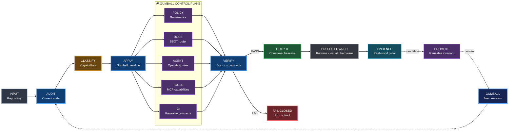

# Gumball architecture

Status: **ACTIVE / AUTHORITATIVE**

## Goal

Gumball provides a reusable engineering control plane that can be adopted by a new repository or introduced incrementally into an existing one.

It separates **portable engineering contracts** from **product-specific proof** and continuously promotes proven reusable improvements back from consumer repositories.

## Blueprint architecture graph

The visual language is defined by [DIAGRAM_STYLE.md](DIAGRAM_STYLE.md) and is part of the baseline propagated to Gumball-enabled repositories.

## Layers

### 1. Platform invariants

Non-negotiable safety properties:

- immutable external workflow/action refs;
- explicit least-privilege permissions;
- fail-closed required checks;
- no silent `continue-on-error: true` bypasses;
- caller-local `Aggregate CI gate`;
- project-specific proof cannot be silently dropped by shared workflows.

### 2. Capabilities

Gumball describes engineering capabilities rather than one technology-specific job graph.

Examples:

- repository policy;
- documentation governance;
- tooling authority and provenance;
- deterministic visual/design engineering;
- lint/typecheck/unit test;
- security analysis;
- build;
- runtime proof;
- release proof;
- provenance/SBOM.

A consumer maps capabilities to its own implementation.

### 3. Profiles

Profiles enable optional policy bundles such as:

- `standard`;
- `monorepo`;
- `mobile`;
- `unreal`;
- `release-critical`.

Profiles do not grant permission to weaken the baseline.

### 4. Consumer-local proof

Product-specific checks remain downstream. Examples include Unreal runtime proofs, Android emulator evidence, Home Lab validation, visual acceptance and hardware tests.

The platform may standardize the **contract** for those proofs without copying their product-specific implementation. Tooling follows [TOOLING_AUTHORITY.md](TOOLING_AUTHORITY.md); visual profiles additionally follow [VISUAL_ENGINEERING.md](VISUAL_ENGINEERING.md).

### 5. Feedback loop

A downstream improvement can become a Gumball capability only after its reusable invariant and failure behavior are understood and covered by contract tests.

See [UPSTREAM_PROMOTION.md](UPSTREAM_PROMOTION.md).

### 6. Dogfooding

Gumball is also a Gumball consumer.

Its own repository must satisfy the baseline it publishes: agent rules, docs router, diagram language, workflow safety, fail-closed aggregate, promotion provenance and doctor checks.

See [DOGFOODING.md](DOGFOODING.md).

## Compatibility boundary

Gumball's product name is independent from its current GitHub repository coordinate. Until the repository itself is renamed and every consumer pin is migrated, executable references remain under `karnalooch/engineering-platform`.
