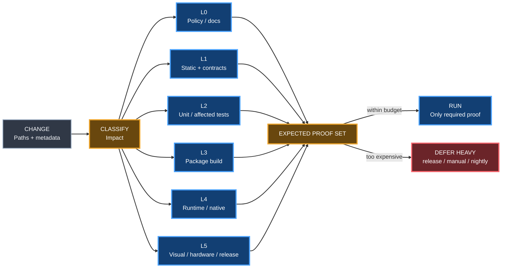

# CI Cost Governor

Status: **ACTIVE / AUTHORITATIVE**

## Objective

The cheapest trustworthy proof wins.

Gumball avoids heavyweight builds by planning evidence before executing expensive work.

## Evidence ladder

## Core rules

### 1. Preflight before build

Cheap checks run first. A heavy build must not start while deterministic policy/static/unit checks are already red.

### 2. Affected surface, not whole repository

Classify changed paths/capabilities and construct the exact expected proof set. Mixed/unknown runtime changes broaden coverage fail-safely.

### 3. Build fingerprint

Heavy build identity is derived from relevant source inputs, lockfiles, toolchain version/configuration and build profile.

If the fingerprint already has a verified artifact, reuse it instead of rebuilding.

### 4. Build once per fingerprint

Multiple downstream proofs consume the same artifact. Runtime smoke, packaging checks, visual proof and release promotion must not independently compile identical source when one immutable artifact can be shared.

### 5. Heavy proof lanes

L4/L5 evidence runs automatically only when required by change classification or release policy.

Otherwise route it to one of:

- manual dispatch;
- release candidate gate;
- nightly verification;
- dedicated self-hosted runner proof.

### 6. Superseded work cancellation

New commits cancel obsolete PR runs. Heavy work must use concurrency groups keyed to repository/PR/profile.

### 7. Lazy matrices

Generate only matrix entries for affected components/platforms. Do not start an all-platform matrix when one component changed.

### 8. Budget

Profiles declare soft CI budgets, for example:

- light PR: target <= 5 runner-minutes;
- standard PR: target <= 15 runner-minutes;
- heavy automatic PR: at most one heavyweight build lane;
- release/full proof: separate budget and event.

When an automatic plan exceeds its PR budget, Gumball should defer non-merge-critical heavy evidence instead of silently burning the budget.

### 9. Cache is not proof

Caches accelerate computation. Reusable immutable artifacts plus manifests are proof inputs. Never treat a cache hit alone as release provenance.

## Output

The planner should expose a machine-readable plan including:

- impact classes;
- required capabilities;
- proof tier;
- estimated cost class;
- heavy build fingerprint;
- reusable artifact candidate;
- deferred proofs;
- resulting `ci:light|standard|heavy` label.

The caller-local Aggregate Gate validates the planned expected proof set; it must not require intentionally deferred non-merge-critical evidence.

