# Gumball dogfooding contract

Status: **ACTIVE / AUTHORITATIVE**

## Rule

**Gumball must satisfy Gumball.**

The platform repository is the first consumer of its own reusable engineering invariants. A rule that cannot be applied safely to Gumball itself needs an explicit reason, scope boundary and contract test.

Dogfooding does **not** mean running a destructive bootstrap over the repository. It means the repository continuously proves the same invariants it expects from consumers.

## Self-hosted control loop

```mermaid
flowchart LR
    DEV["⚡ Change<br/>Gumball source"]:::event --> AUDIT["🔎 AUDIT<br/>repo + contracts"]:::blue
    AUDIT --> POLICY["🛡 GOVERNANCE<br/>immutable refs<br/>risk rules"]:::purple
    POLICY --> DOCS["📚 DOCS ROUTER<br/>SSOT + catalog"]:::cyan
    DOCS --> TEST["🧪 CONTRACT TESTS<br/>doctor + promote<br/>CI primitives"]:::green
    TEST --> AGG["◆ Aggregate CI gate<br/>FAIL CLOSED"]:::orange
    AGG -->|PASS| PLATFORM["🎮 GUMBALL<br/>platform revision"]:::core
    PLATFORM --> CONSUMER["⬢ Consumers<br/>YACS · 4VELO · ..."]:::consumer
    CONSUMER --> PROMOTE["↩ Promotion candidates<br/>candidate → proven → platform"]:::pink
    PROMOTE --> AUDIT

    classDef event fill:#2b2b2b,stroke:#f2c94c,color:#ffffff,stroke-width:3px;
    classDef blue fill:#102a43,stroke:#2d9cdb,color:#ffffff,stroke-width:3px;
    classDef purple fill:#2b1746,stroke:#9b51e0,color:#ffffff,stroke-width:3px;
    classDef cyan fill:#10333c,stroke:#56ccf2,color:#ffffff,stroke-width:3px;
    classDef green fill:#123824,stroke:#27ae60,color:#ffffff,stroke-width:3px;
    classDef orange fill:#492a0b,stroke:#f2994a,color:#ffffff,stroke-width:4px;
    classDef core fill:#172554,stroke:#60a5fa,color:#ffffff,stroke-width:4px;
    classDef consumer fill:#252525,stroke:#bdbdbd,color:#ffffff,stroke-width:2px;
    classDef pink fill:#461b35,stroke:#eb5757,color:#ffffff,stroke-width:3px;
```

The visual style deliberately mirrors an Unreal Engine / Blueprint node graph: dark nodes, typed colors and explicit execution flow. The diagram is documentation only; the executable contract is enforced by `gumball doctor` and CI.

## Required self-proofs

When `gumball doctor` detects the Gumball source repository, it additionally requires:

- this dogfooding contract;
- the Gumball tool capability manifest and machine-readable tooling authority policy;
- the tooling-authority and visual-engineering contracts plus their drift validator;
- the shared Blueprint diagram style contract that is also propagated to consumers;
- the repository OS policy, lifecycle/release/labels/CI-cost contracts and trusted reconciler workflow;
- the Proof Broker policy, trusted dispatch workflow and exact-SHA/dedupe contract;
- at least one platform promotion provenance record;
- Gumball CI to invoke `gumball doctor`;
- Gumball CI to invoke `gumball promote`;
- Gumball CI to validate the documentation router;
- Gumball CI to run Gumball contract tests;
- Gumball CI to run repository OS and GitHub-ops contract tests;
- Gumball CI to run Proof Broker contract tests and policy validation;
- a caller-local fail-closed `Aggregate CI gate`.

These are additional checks. They do not replace the ordinary workflow-safety checks.

## Exceptions

A platform rule may be inapplicable to the source repository only when all are true:

1. the reason is structural, not convenience;
2. the exception is documented in an authoritative contract;
3. the exception cannot silently weaken consumer behavior;
4. a contract test prevents the exception from expanding accidentally.

## Bootstrap boundary

`gumball apply` remains conservative and non-destructive.

Gumball does **not** repeatedly run `apply --write` against itself. The source repository is maintained normally; `doctor` proves that the resulting repository conforms to the platform contract.
