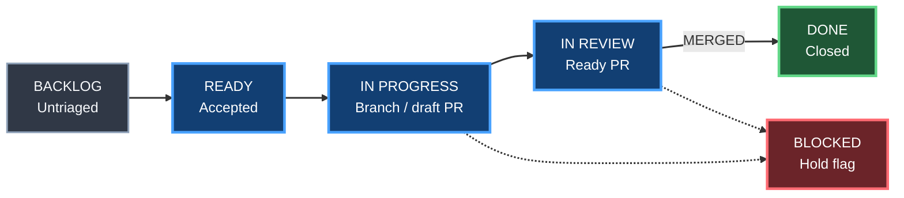

# GitHub Projects flow

Status: **ACTIVE / AUTHORITATIVE**

## Principle

GitHub issue/PR state is operational truth. GitHub Projects is the planning view.

Gumball reconciles the board from real repository events so cards move without depending on someone remembering to drag them manually.

## Canonical flow

The default status vocabulary mirrors the board pattern used by Gumball consumers:

Repositories may map those semantic states to local option names such as `Todo` or `Triage`.

## Reconciliation rules

Default desired state:

| Repository evidence | Desired Project state |
|---|---|
| open issue, not accepted | Backlog |
| open issue + `status:ready` | Ready |
| linked active branch or draft PR | In Progress |
| ready-for-review open PR | In Review |
| merged PR / closed issue | Done |
| `lifecycle:blocked` | keep lifecycle state + Blocked flag, or Blocked status when configured |

Mixed evidence fails safe toward the most active truthful state rather than pretending work is Done.

## Two-way behavior

Repository -> Project synchronization is the safe default.

Project -> repository mutation is opt-in:

- moving an issue to `Done` may close it only with `close_issue_on_done=true`;
- moving to `Ready` may add `status:ready`;
- a Blocked option/field may add/remove `lifecycle:blocked`.

Gumball must never close a PR merely because a board card was dragged to Done.

## Access model

Projects v2 automation may require a token with Project permissions that the normal repository `GITHUB_TOKEN` does not have.

When Projects integration is enabled but required credentials or IDs are missing, reconciliation reports **BLOCKED**. It must not print a fake PASS.

Configuration stores project owner/number and semantic field names, never private tokens.

## Drift

A reconciliation pass classifies items as:

- `MATCH`;
- `MOVE`;
- `CLOSE`;
- `REOPEN/ACTIVE`;
- `BLOCKED`;
- `UNKNOWN`.

Unknown mappings do not mutate.

