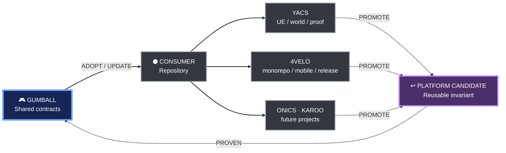

# Gumball documentation

This directory is the navigation layer and authority map for Gumball.

> Start here before changing shared CI, governance, security, adoption behavior, agent rules, tooling or release policy.

## What Gumball is

Gumball is a **living engineering platform**, not a static template.

Consumers inherit reusable engineering contracts. Consumers also act as real-world laboratories: reusable improvements discovered downstream are generalized, tested and promoted back into Gumball.

The graph follows the shared [Blueprint diagram style](DIAGRAM_STYLE.md), inspired by Unreal Engine Blueprint graphs while remaining normal Mermaid stored as text.

## Authority map

| Need | Read first | Status |
|---|---|---|
| Understand the platform shape | [ARCHITECTURE.md](ARCHITECTURE.md) | **Authoritative** |
| Understand Gumball self-application | [DOGFOODING.md](DOGFOODING.md) | **Authoritative** |
| Use the shared Blueprint diagram language | [DIAGRAM_STYLE.md](DIAGRAM_STYLE.md) | **Authoritative** |
| Adopt Gumball in a repository | [ADOPTION.md](ADOPTION.md) | **Authoritative** |
| Understand PR vs release/full CI | [CI_MODEL.md](CI_MODEL.md) | **Authoritative** |
| Promote a downstream improvement upstream | [UPSTREAM_PROMOTION.md](UPSTREAM_PROMOTION.md) | **Authoritative** |
| Bootstrap with one agent prompt | [ONE_PROMPT_BOOTSTRAP.md](ONE_PROMPT_BOOTSTRAP.md) | **Authoritative prompt contract** |
| Configure MCP/tool capabilities | [MCP_AND_TOOLS.md](MCP_AND_TOOLS.md) | **Authoritative** |
| Consume reusable workflows | [CONTRACT.md](CONTRACT.md) | **Authoritative caller contract** |
| Aggregate merge gate | [AGGREGATE_GATE.md](AGGREGATE_GATE.md) | **Authoritative** |
| Governance | [GOVERNANCE_GUARD.md](GOVERNANCE_GUARD.md) | **Authoritative** |
| Auto-merge | [AUTO_MERGE.md](AUTO_MERGE.md) | **Authoritative** |
| Versioning and rollout | [VERSIONING.md](VERSIONING.md), [ROLLOUT.md](ROLLOUT.md) | **Authoritative** |

## Operating principles

1. **Fail closed.** Missing, unknown or unexpectedly skipped required evidence is failure.
2. **Dogfood the platform.** Gumball must satisfy the same baseline invariants it asks consumers to adopt.
3. **Keep the final aggregate local.** The consumer owns the exact required proof graph.
4. **Pay for evidence proportionally.** Pull requests run the smallest trustworthy surface; expensive whole-system proofs move to explicit release/full-validation lanes.
5. **Documentation is routing, not archaeology.** Current SSOTs are explicit; historical evidence must not silently become current truth.
6. **Agents preserve local intent.** Existing project rules are merged or extended, not blindly overwritten.
7. **Downstream innovation flows upstream.** Promote reusable invariants, not project-specific scripts.
8. **Immutable execution.** External Actions and shared workflow consumption use reviewed immutable SHAs.
9. **Shared visual language.** New or substantially revised architecture/workflow diagrams use the Gumball Blueprint style unless the project owns a stronger explicit convention.

## Current compatibility note

The GitHub repository is still named `karnalooch/engineering-platform`. Existing consumers must continue using that coordinate until a dedicated repository-rename migration updates and proves all immutable references.
