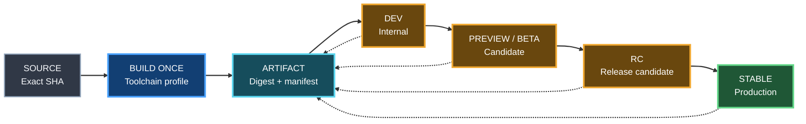

# Release, version and artifact lineage

Status: **ACTIVE / AUTHORITATIVE**

## Goal

Every promoted application version must answer four questions:

1. What application version is this?
2. What delivery stage is it in?
3. What exact source revision produced it?
4. What exact artifact bytes are being promoted?

## Build once, promote many



Promotion should reuse the exact artifact digest instead of rebuilding the same version for each stage.

## Canonical stages

Baseline semantic stages:

`dev -> preview -> beta -> rc -> stable`

A project may collapse or rename stages, but the order and mapping must be explicit.

## Release manifest

Every releasable artifact should have a machine-readable manifest containing at least:

```json
{
  "schema_version": 1,
  "application": {"name": "example", "version": "1.4.0", "stage": "rc"},
  "source": {"sha": "<40-char sha>"},
  "build": {"id": "provider-build-id", "profile": "release"},
  "artifact": {"name": "example", "sha256": "<digest>"},
  "provenance": {"gumball_version": "0.4.0"}
}
```

Platform-specific fields such as Android versionCode, iOS build number, Unreal package version, Docker digest or desktop installer version extend this manifest.

## Version sources

Gumball does not force every technology to store version in the same file.

The consumer declares its authoritative version source, for example:

- `package.json`;
- Expo/app config;
- Python project metadata;
- Unreal/project metadata;
- root `VERSION`;
- generated release manifest.

Conflicting version sources fail the release doctor.

## Stage gates

Promotion to a later stage requires:

- exact artifact digest;
- exact source SHA;
- version monotonicity according to project policy;
- all proof required by the target stage;
- no silent rebuild unless policy explicitly defines a new build identity.

Stable release is a provenance event, not merely a Git tag.

