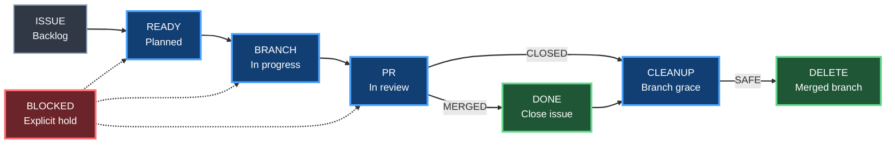

# Repository lifecycle

Status: **ACTIVE / AUTHORITATIVE**

## Goal

Gumball keeps repository work surfaces finite, explainable and synchronized.

Branches, pull requests, issues and GitHub Projects are one lifecycle, not four unrelated inboxes.

## Branch hygiene

Automatic deletion is allowed only when evidence is unambiguous:

- never delete the default branch or a protected branch;
- never delete a branch referenced by an open pull request;
- delete a merged PR branch after the configured grace period;
- a branch from a closed-unmerged PR may be deleted only after a longer grace period;
- an orphan branch with no PR is reported as stale first and is not deleted by default;
- release/hotfix branches may have an explicit retention policy.

The reconciler must report what it plans to delete before mutation. A `lifecycle:keep` policy or configured branch pattern overrides automatic cleanup.

## Pull request lifecycle

Recommended defaults:

- draft PR: active work, no stale auto-close while it remains inside the draft grace window;
- ready PR: should be in Project status `In Review`;
- merged PR: Project status becomes `Done`, linked closing issues are expected to close, head branch enters cleanup grace;
- closed-unmerged PR: Project status becomes `Done` or `Cancelled` when that option exists, head branch enters the longer closed-unmerged grace;
- stale PR: add `lifecycle:stale`; after the configured grace period close only when policy allows and `lifecycle:keep` is absent.

## Issue lifecycle

Issues are more durable than PRs and are not blindly closed merely because they are old.

Safe automatic closure sources:

- GitHub closes the issue from an accepted closing reference after merge;
- Project status is manually moved to `Done` and `projects.close_issue_on_done=true`;
- an explicit `lifecycle:auto-close` label is present and stale grace expires.

Otherwise stale issues are labelled/reported, not destroyed.

## Projects reconciliation

See [PROJECTS_FLOW.md](PROJECTS_FLOW.md).

## Doctor contract

Gumball doctor should surface:

- merged branches awaiting safe cleanup;
- branches referenced by no open work;
- stale PRs/issues;
- open PRs with missing lifecycle/type/risk/CI labels;
- Project items whose status disagrees with issue/PR reality;
- closed work that still appears active on a Project board.

Repository hygiene findings are evidence. Mutation follows the configured lifecycle policy.

